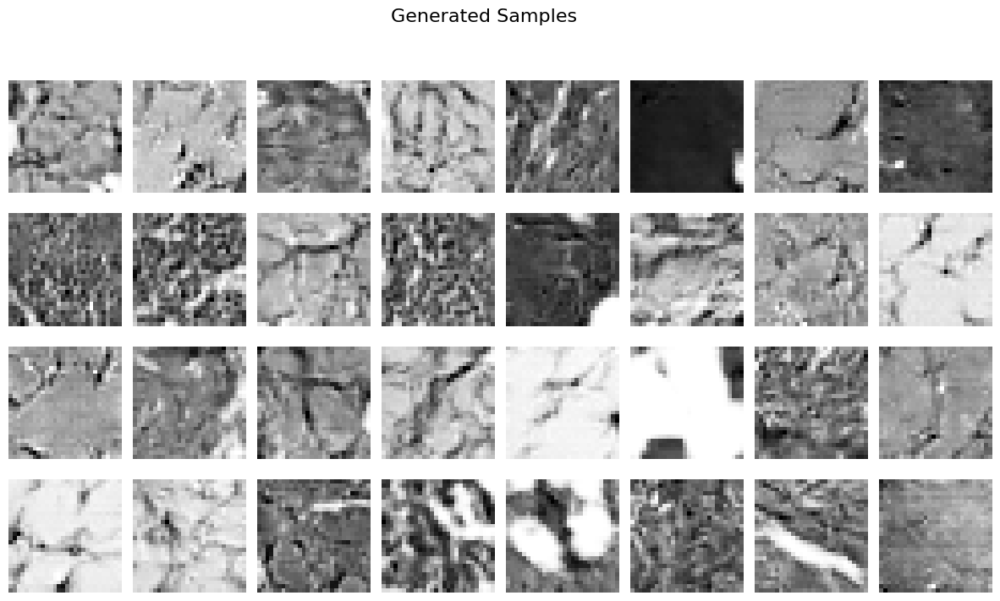

# LSGAN for MedMNIST PathMNIST

This repository contains an implementation of a Least Squares Generative Adversarial Network (LSGAN) for generating 28×28 grayscale images from the MedMNIST PathMNIST dataset. The project includes data preparation, network architecture definition, training routines with multi-GPU support, evaluation using FID and Inception Score, and visualization of generated images.

---

## Table of Contents

- [Overview](#overview)
- [Repository Structure](#repository-structure)
- [Setup and Installation](#setup-and-installation)
  - [Prerequisites](#prerequisites)
  - [Installation Steps](#installation-steps)
- [Usage](#usage)
  - [Training](#training)
  - [Evaluation](#evaluation)
- [Results](#results)
- [Visualizations](#visualizations)
- [Multi-GPU Support](#multi-gpu-support)
- [License](#license)
- [Contact](#contact)

---

## Overview

This project implements an LSGAN to generate synthetic images that mimic the distribution of the MedMNIST PathMNIST dataset. The generator is evaluated using two main metrics:

- **FID Score:** 44.6029  
- **Inception Score:** 1.0788 ± 0.0058

The FID score measures the similarity between the distributions of real and generated images, while the Inception Score evaluates both image quality and diversity.

---
---

## Setup and Installation

### Prerequisites

- **Python 3.x**
- [Pip](https://pip.pypa.io/en/stable/installation/)
- [Jupyter Notebook](https://jupyter.org/install)
- [CUDA](https://developer.nvidia.com/cuda-downloads) (for GPU support)

### Installation Steps

1. **Clone the Repository**

   ```bash
   git clone https://github.com/yourusername/assignment-4.git
   cd assignment-4
2.**Install Required Packages**

Install all necessary packages with:
```
pip install medmnist torch torchvision tqdm matplotlib scikit-learn seaborn scipy tensorboard
```
3.**Dataset Download**

The MedMNIST dataset is automatically downloaded when running the notebook. Data will be stored in a data directory within your current working directory.
# **Usage**
##Training
To train the LSGAN, run the assingment-4.ipynb notebook. The notebook performs the following tasks:

##Data Preparation:
Loads and preprocesses the MedMNIST PathMNIST dataset with appropriate transformations.

##Model Definition:
Defines the Generator and Discriminator architectures, including initialization of weights.

##Training Routine:
Trains the LSGAN using the Least Squares loss function over 50 epochs, with:

Periodic checkpointing (every 5 epochs)

Logging of losses using TensorBoard

Saving of generated images at regular intervals

# **Evaluation**
After training, the notebook loads the final Generator from a saved checkpoint and evaluates its performance on the test dataset:

Metrics Calculated:

FID (Fréchet Inception Distance)

Inception Score

Evaluation Output:

The evaluation metrics are printed to the console.

Generated sample images are saved in the evaluation directory.

Metrics are stored in a JSON file for record keeping.
Results
The final evaluation metrics obtained from the model are:

# **FID Score: 44.6029**

# **Inception Score: 1.0788 ± 0.0058**

These scores provide a quantitative evaluation of the model's ability to generate realistic and diverse images.

## Visualizations

### Generated Samples
Here are some images generated by the LSGAN after training:



These visualizations demonstrate the model's ability to learn and reproduce the style of the PathMNIST dataset.
All visualizations are saved to the generated_images and evaluation directories, respectively.

# Multi-GPU Support
The implementation automatically detects the availability of CUDA. If multiple GPUs are available, the code will utilize them via PyTorch's DataParallel to accelerate training. If no GPU is detected, the CPU will be used.

